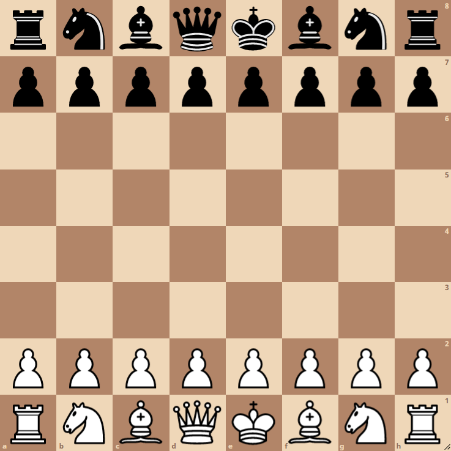

# not_not_Bot
https://www.youtube.com/watch?v=E8ckoTkNvW8



This project is a simple chess AI that can be played on the lichess.org website

### Installation

Clone the repository and run the chessbot.py file

```sh
$ git clone https://github.com/not-notAlex/chessbot
$ cd chessbot
$ ./chessbot.py
```
If ```1763@holbertonschool.com``` is showing up the program is running successfully

### How to Use
      
Create or sign into a lichess account. Then on the homepage click PLAY WITH A FRIEND. Create the challenge with any time control, but make sure you play as white. Then search for the user not_not_Bot. It should accept the challenge automatically. Make sure to close out any games before submitting new challenges. View the above youtube link for an example of how to do this.

### Contributing

 1. **Fork** the repo on GitHub
 2. **Clone** the project to your own machine
 3. **Commit** changes to your own branch
 4. **Push** your work back up to your fork
 5. Submit a **Pull request** so that we can review your changes

### Related Projects

https://github.com/SebLague/Chess-AI

https://github.com/luweizhang/chess-ai

### Licensing

Copyright (c) 2021, Alexander Smith
All rights reserved.

Redistribution and use in source and binary forms, with or without
modification, are permitted provided that the following conditions are met:

1. Redistributions of source code must retain the above copyright notice, this
   list of conditions and the following disclaimer.

2. Redistributions in binary form must reproduce the above copyright notice,
   this list of conditions and the following disclaimer in the documentation
   and/or other materials provided with the distribution.

THIS SOFTWARE IS PROVIDED BY THE COPYRIGHT HOLDERS AND CONTRIBUTORS "AS IS"
AND ANY EXPRESS OR IMPLIED WARRANTIES, INCLUDING, BUT NOT LIMITED TO, THE
IMPLIED WARRANTIES OF MERCHANTABILITY AND FITNESS FOR A PARTICULAR PURPOSE ARE
DISCLAIMED. IN NO EVENT SHALL THE COPYRIGHT HOLDER OR CONTRIBUTORS BE LIABLE
FOR ANY DIRECT, INDIRECT, INCIDENTAL, SPECIAL, EXEMPLARY, OR CONSEQUENTIAL
DAMAGES (INCLUDING, BUT NOT LIMITED TO, PROCUREMENT OF SUBSTITUTE GOODS OR
SERVICES; LOSS OF USE, DATA, OR PROFITS; OR BUSINESS INTERRUPTION) HOWEVER
CAUSED AND ON ANY THEORY OF LIABILITY, WHETHER IN CONTRACT, STRICT LIABILITY,
OR TORT (INCLUDING NEGLIGENCE OR OTHERWISE) ARISING IN ANY WAY OUT OF THE USE
OF THIS SOFTWARE, EVEN IF ADVISED OF THE POSSIBILITY OF SUCH DAMAGE.

### Authors

-[Alex Smith]


[Alex Smith]: <https://github.com/not-notAlex>
